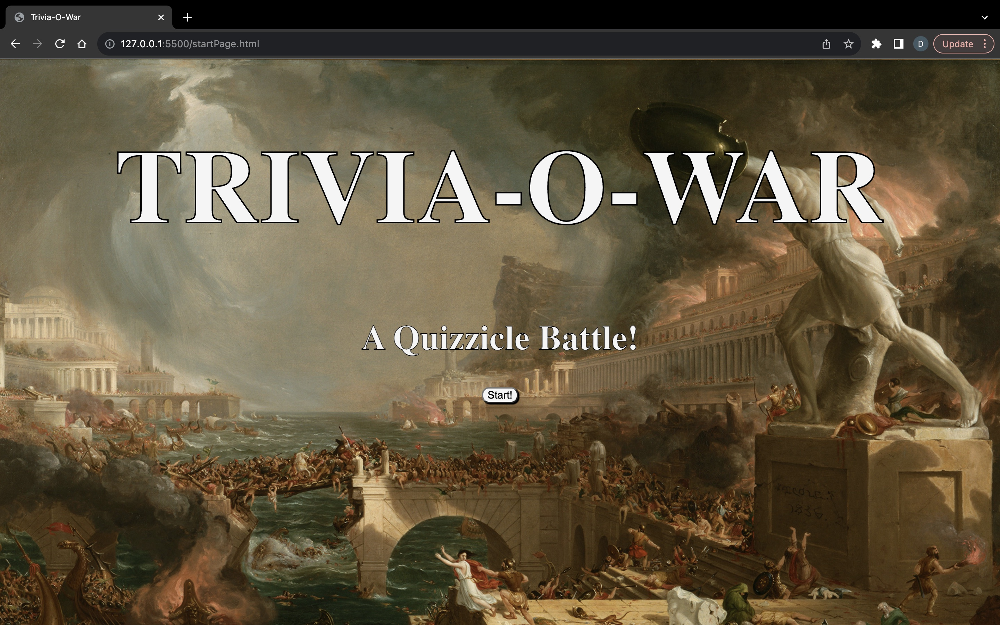
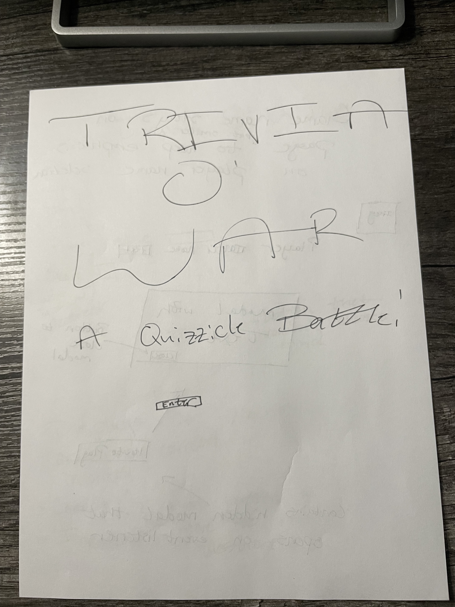

# Trivia-O-War
Trivia-O-War is a classic take on trivia questions that tests the player on the subject at hand; in this case basic JavaScript fundamentals. The game features trivia questions about JavaScript fundamentals assigned at random with four multiple choice questions containing 1 correct answer and 3 incorrect answers. The goal of the game is for the player to recognize these JavaScript fundamentals while answering the trivia accordingly. Each correct answer adds 8 points to your score and each incorrect answer removes 4 points from your score. Take caution, if you answer the first question wrong, you lose the game.

# Technologies
    -JavaScript 
    -HTML
    -CSS
    -Sprite pixel art used within game structure: https://samuellee.itch.io/spartan-warrior-animated-pixel-art 

# How To Play 
    1. Select your player name and press "Enter Player" to save that name.
    2. Once your player name has been saved, if you wish to choose so, open the "How To Play" button to better understand how the game is played, using the "Back To Game" button allows you to go back to the previous screen.
    3. If you are ready to start the game you can now press "Start" button to move on to the game screen.
    4. Once on the game screen you can use the "Take Turn" button to begin your questions.
    5. Answering the trivia question allows you to use the "Next Turn" button to continue.
    6. Each correct answer adds 8 points to your score, if your score reaches 80 points you are declared the winner and can choose to play again.
    7. Each incorrect answer removes 4 points from your score, if the first trivia question is answered incorrectly however, you lose and can choose to try again.

# User Stories
    -As a player I want to know how to play, and if I know how to play I don't want to always be reminded when I play again
    -As a player I want to be able to enter my name allowing me to name my character
    -As a player I want to have a selection of answers to choose from so as to avoid a typing error
    -As a player I want to know whether I answered a question correctly or incorrectly and how I am awarded accordingly 
    -As a player I want to be able to start the game all over whether declared the winner or loser

# Stretch Goals
    -As a player I want an animation showcasing who won
    -As a player I want to be able to select the genre of trivia questions I get on screen
    -As a player I want to be able to select the difficulty of trivia questions that pop-up on screen
    -As a player I want to be able to play against another player or a computer to test my skills and practice my trivia
    -As a player I want background audio to keep the webpage fresh
    -As a player I want audio to play when an answer is correct or incorrect

# Wireframes 

# Overcoming Hurdles
    Some of the major hurdles/problems that I had during this project were re-designing the major concept of the game. It was first set out to be a two player game with two different scores and two different characters pulling each other in a tug-o-war fashion based on answering trivia. Creating a structure in which the characters would move across the screen was my first problem, I had scraped it entirely and insted opted for a point system. My second obstacle was keeping track of who the points would be assigned to when a question was answered, because my player was originally selected at random, I wa confused on how to keep track of the players and their points. So I opted into making the game a single player game, in which the player wins by reaching a set amount of points. These problems, unfortunately unsolved, are some that I plan on coming back to with hope that I have more knowledge in JavaScript to tackle those functionalities including coming back to complete the stretch goals that I had in mind. 
